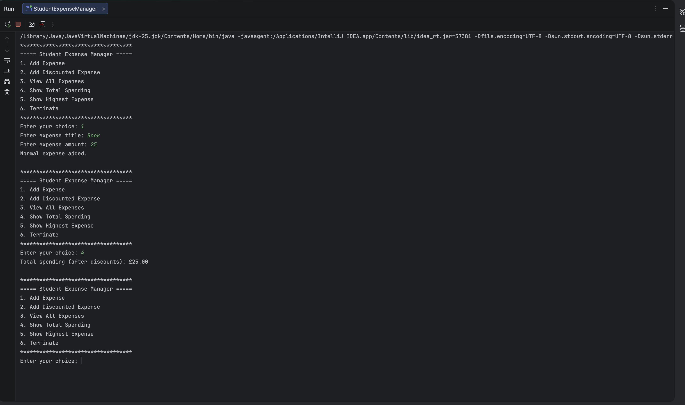

# 💰 Student Expense Manager

A console-based Java application for managing student expenses, built to demonstrate core Object-Oriented Programming (OOP) concepts and practical Java development.

The application allows users to record normal and discounted expenses, calculate spending totals, identify the highest expense, and interact with the program through a menu-driven console interface.

## ✨ Features

- Add standard expenses
- Add discounted expenses
- Automatically calculate prices after discounts
- View all recorded expenses
- Calculate total spending after discounts
- Find the highest expense
- Validate numeric user input
- Handle invalid menu selections
- Menu-driven console interface

## 🧠 Object-Oriented Programming Concepts

This project demonstrates several core Java and OOP concepts:

- **Encapsulation** — expense data is stored in private fields and accessed through methods
- **Inheritance** — `DiscountedExpense` extends the `Expense` class
- **Polymorphism** — normal and discounted expenses are stored together as `Expense` objects
- **Method Overriding** — `DiscountedExpense` overrides `getFinalAmount()` and `showInfo()`
- **Constructors** — used to initialise expense objects
- **Collections** — `ArrayList<Expense>` stores the application's expenses

## 🛠️ Technologies

- Java
- Object-Oriented Programming
- Java ArrayList
- Java Scanner
- IntelliJ IDEA
- Git
- GitHub

## 📸 Preview



## 📂 Project Structure

```text
student-expense-manager/
├── src/
│   ├── Expense.java
│   ├── DiscountedExpense.java
│   └── StudentExpenseManager.java
├── .gitignore
├── README.md
└── expense-manager-preview.png
